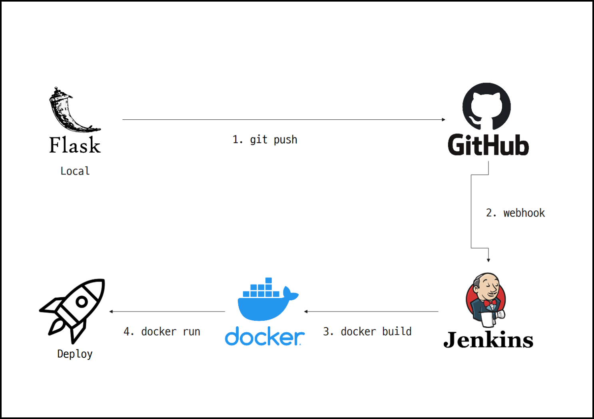

# 프로젝트

## TOC

- [프로젝트](#프로젝트)
  - [TOC](#toc)
  - [계획](#계획)
    - [폴더 구조](#폴더-구조)
  - [개발](#개발)
    - [데이터베이스](#데이터베이스)
    - [REST API](#rest-api)
  - [배포](#배포)
    - [도커 사용](#도커-사용)
    - [Jenkins를 이용한 자동배포환경](#jenkins를-이용한-자동배포환경)

## 계획

### 폴더 구조

## 개발

### 데이터베이스

### REST API

## 배포

### 도커 사용

### Jenkins를 이용한 자동배포환경

jenkins를 사용하여 자동 배포환경을 구성했다.

github 저장소에 push 하면 jenkins가 자동으로 도커이미지를 만들고 실행해준다.
